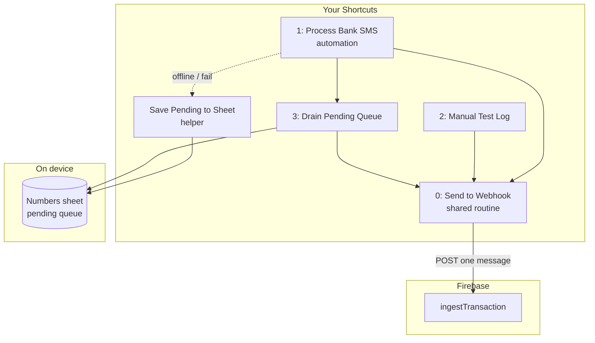

# Phase 2 — iOS Shortcuts

**Import ready-made shortcuts** from [`export/`](export/) — no need to build from scratch.

```bash
# Regenerate after changes (macOS only)
python3 ios/generate-shortcuts.py
```

## Quick import (recommended)

1. AirDrop these files from `ios/export/` to your iPhone:
   - **`Expense - Send to Webhook.shortcut`** — core routine (import first)
   - **`Expense - Manual Test Log.shortcut`** — paste SMS → test → alert
   - **`Expense - Drain Pending (setup).shortcut`** — setup notes for pending queue

2. Tap each file on iPhone → **Add Shortcut**

3. When importing **Send to Webhook**, paste `WEBHOOK_API_KEY` and **bank name** when prompted

4. Run **Manual Test Log** → paste a bank SMS → confirm alert shows `transactionId`

5. **Finish manual setup:** [`IPHONE-UPDATE-GUIDE.md`](IPHONE-UPDATE-GUIDE.md) (Numbers sheet, drain shortcut, SMS automation)

> Shortcuts are signed with macOS `shortcuts sign` and are safe to share. Your API key is **not** embedded — you enter it once at import.

### Why not all 3 shortcuts are fully automated?

| Shortcut | Importable? | Notes |
|----------|-------------|-------|
| Send to Webhook | ✅ Full | Generated + signed |
| Manual Test Log | ✅ Full | Calls Send to Webhook |
| Drain Pending | ⚠️ Setup helper | Numbers row loops are device-specific — finish using [`shortcuts/03-drain-pending.md`](shortcuts/03-drain-pending.md) |
| Process Bank SMS | Manual automation | Create **Automation → Message** once on iPhone (5 min) |

Numbers sheet + SMS automation still need one-time setup on your phone because Apple ties them to your bank senders and your Numbers file.

---

Three shortcuts + one shared routine + one helper. All use the **same** `ingestTransaction` webhook (one message per call).

## Architecture



## Shortcuts to build (order matters)

| # | Name | Type | Purpose |
|---|------|------|---------|
| **0** | Expense: Send to Webhook | Routine | POST one message → returns JSON |
| **H** | Expense: Save Pending to Sheet | Helper | Append failed/offline row to Numbers |
| **3** | Expense: Drain Pending Queue | Manual / called by #1 | Sync all `pending` rows |
| **2** | Expense: Manual Test Log | Manual | Paste SMS → test → show alert |
| **1** | Expense: Process Bank SMS | Automation target | Real bank SMS flow |

Build guides: [`shortcuts/`](shortcuts/)

## One-time setup

### 1. Numbers pending queue

1. Open **Numbers** on iPhone/Mac
2. Create spreadsheet: **Expense Pending Queue**
3. Rename first sheet to **Pending**
4. Row 1 headers (exact names):

   | A | B | C | D | E |
   |---|---|---|---|---|
   | idempotencyKey | raw | status | createdAt | lastError |

5. Delete sample data rows (keep headers only)
6. Save to iCloud (so Shortcuts can access it)

Import template: [`templates/pending-queue.csv`](templates/pending-queue.csv)

### 2. Webhook config

| Setting | Value |
|---------|-------|
| URL | `https://asia-south1-auto-expense-tracker-2026.cloudfunctions.net/ingestTransaction` |
| Header | `X-API-Key: <your WEBHOOK_API_KEY>` |
| Body | `{ "raw", "source": "ios_shortcut", "receivedAt", "idempotencyKey" }` |

See [`config.example.json`](config.example.json) for non-secret defaults.

### 3. Bank SMS senders

When creating the **Message** automation, add senders you receive alerts from, e.g.:

- `HBL`, `UBL`, `MCB`, `Meezan`, `BAFL`, `Faysal`

Add only senders you actually get transaction SMS from.

## Bulk vs one-by-one?

**Use one-by-one.** Shortcut 3 loops pending rows and calls Shortcut 0 for each.

Reasons:
- No new Cloud Function
- `idempotencyKey` per row prevents double-logging on retry
- Server-side dedup still catches SMS + email duplicates
- One failed message does not block the rest
- Easier to debug in Firestore (`raw_ingestions` per message)

A bulk endpoint only makes sense at very high volume (hundreds per minute). For personal bank SMS, one-by-one is correct.

## Official flow (Shortcut 1)

```
Bank SMS arrives
    → Automation runs Shortcut 1
        → Shortcut 3 drains pending rows (one-by-one)
        → If no internet → save to Numbers as pending
        → Else POST current SMS via Shortcut 0
        → On webhook fail → save to Numbers as pending
```

## Manual test flow (Shortcut 2)

```
You run shortcut
    → Ask for Input (paste SMS)
    → Shortcut 0 POSTs to webhook
    → Show Alert / Show Content with transactionId or error
```

## Drain pending flow (Shortcut 3)

```
You run shortcut (or Shortcut 1 calls it)
    → Find Numbers rows where status = pending
    → Repeat each row:
        → Shortcut 0 POST (reuse row's idempotencyKey)
        → On success: status = sent
        → On fail: status = failed, lastError = message
    → Show summary alert
```

## Testing checklist

- [ ] **Shortcut 2** with sample SMS → `transactionId` in alert
- [ ] Same SMS again → `duplicate: true`
- [ ] Airplane mode → run Shortcut 1 logic → row appears in Numbers as `pending`
- [ ] Online → **Shortcut 3** → row becomes `sent`, transaction in Firestore
- [ ] Real bank SMS → automation fires (may need to disable Low Power Mode first)

## iOS limitations

| Limitation | Workaround |
|------------|------------|
| Automation may not run instantly | Run Shortcut 3 manually |
| Low Power Mode delays automations | Drain pending when back online |
| Numbers row update can be fiddly | See shortcut 3 guide; Data Jar is an alternative |
| Shortcut must run to retry | New SMS or manual Shortcut 3 |

## Troubleshooting

| Symptom | Fix |
|---------|-----|
| 401 Unauthorized | Wrong `WEBHOOK_API_KEY` in Shortcut 0 |
| 200 but `error` in response | Gemini parse issue — check `raw_ingestions` in Firestore |
| Automation never runs | Check sender filter, enable Run Immediately |
| Numbers not found | Spreadsheet name must match exactly: **Expense Pending Queue** |

## Next: Phase 3

Gmail Apps Script fallback using the same webhook URL.
